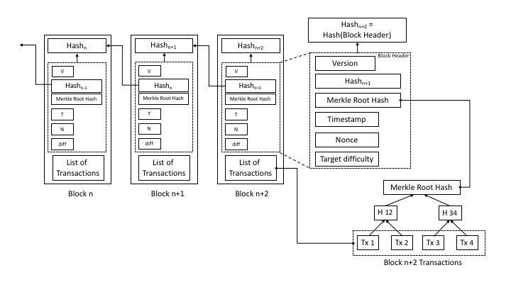

# SoK of Used Cryptography in Blockchain

The underlying fundaments of blockchain are cryptography and cryptographic concepts that provide reliable and secure decentralized solutions. The following figure depicts the blockchain data structure and the fields needed to create the blocks. Although many recent papers study the use-cases of blockchain in different industrial areas, such as finance, health care, legal relations, IoT, information security, and consensus building systems, only few studies scrutinize the cryptographic concepts used in blockchain. This Systematization of Knowledge (SoK) gives a complete picture of the existing cryptographic concepts which have been deployed or have the potential to be deployed in blockchain. The full content can be found [here](https://eprint.iacr.org/2019/735.pdf).



### Summary of Cryptographic Concept used in Blockchain

| Cryptographic Concept | Properties | Instantiation (Reference) |
| ------ | ------ | ------ |
| [Access Control](https://en.wikipedia.org/wiki/Access_control) | Data privacy | [Hyperledger Fabric], [FairAccess], [AC] |
| [Accumulator](https://en.wikipedia.org/wiki/Accumulator_(cryptography)) | Provides Membership Proofs, Anonymity | [Batching Techniques for Accumulators in Blockchain] |
| [Aggregate Signature](https://link.springer.com/referenceworkentry/10.1007%2F978-1-4419-5906-5_139) | Fast Signature Verification | [Tested in Bitcoin] |
| [Commitment Scheme](https://en.wikipedia.org/wiki/Commitment_scheme) | Non-Repudiation | [Used in Bullteproof], [Monero], [Ouroboros] |
| [Decentralised Authorization](https://ieeexplore.ieee.org/document/4221107) | Data Privacy | [BlendCAC], [WAVE] |
| [Encryption Scheme](https://en.wikipedia.org/wiki/Encryption) | Confidentiality and Anonymity | [Kadena], [Hyperledger Fabric], [Tendermint] |
| [Identity Based Encryption](https://en.wikipedia.org/wiki/ID-based_encryption) | No Public Key Distribution Infrastructure | [BAVP], [BLIC] |
| [Incremental Cryptography](http://www.wisdom.weizmann.ac.il/~oded/p_bgg.html) | Efficiency Improvement | [Kadena] |
| [Lightweight Cryptography](https://ieeexplore.ieee.org/abstract/document/4397176) | Fast, less Memory/Energy Consumption | [LSB], [EVCE] |
| [Obfuscation](https://en.wikipedia.org/wiki/Obfuscation_(software)) | Privacy | [Been tested in Bitcoin] |
| [Oblivious RAM](https://en.wikipedia.org/wiki/Oblivious_RAM) | Confidentiality and Integrity | [Solidus], [EVORAM] |
| [Oblivious Transfer](https://en.wikipedia.org/wiki/Oblivious_transfer) | Data Privacy | [Searchain], [OT] |
| [Post-Quantum Cryptography](https://en.wikipedia.org/wiki/Post-quantum_cryptography) | Quantum Resistant | [Post-Quantum Blockchain], [PQC1], [PQC2] |
| [Private Information Retrieval](https://en.wikipedia.org/wiki/Private_information_retrieval) | Data Privacy | [Private Blockchain Queries from PIR] |
| [Proof of Retrievability](https://dl.acm.org/citation.cfm?id=1655015) | Cloud Data Recovery | [Permacoin], [Retricoin], [Storj] |
| [Secret Sharing](https://en.wikipedia.org/wiki/Secret_sharing) | Data privacy | [SHARVOT], [Wanchain] |
| [Secure Multiparty Computation](https://en.wikipedia.org/wiki/Secure_multi-party_computation) | Privacy of Peers and Smart Contract | [Enigma], [Hawk], [Wanchain] |
| [Signature Scheme](https://en.wikipedia.org/wiki/Digital_signature) | Integrity and Authentication | [Multichain], [CryptoNote] |
| [Verifiable Delay Function](https://eprint.iacr.org/2018/601.pdf) | Less Parallelism, Fast Verification | [Chia Network] |
| [Verifiable Random Function](https://en.wikipedia.org/wiki/Verifiable_random_function) | Verifiable Pseudorandom Output | [Algorand], [Ouroboros Praos], [Dfinity] |
| [White-Box Cryptography](https://link.springer.com/chapter/10.1007/3-540-36492-7_17) | Data Privacy | [Runtime Self-Protection in Blockchain Ledger] |
| [Zero-Knowledge Proof](https://en.wikipedia.org/wiki/Zero-knowledge_proof) | User and Data privacy | [Zerocoin], [Zerocash] |

----

We also postulate 21 challenging problems that cryptographers interested in blockchain can work on. The problems are as follows:

----
#### Research Problem 1:
Construct sustainable blockchain systems that have one of the following properties:

1. They are provably resistant to give mining advantages to ASIC miners as opposite to GPU and CPU miners.
2. They are provably resistant to give mining advantages to ASIC and GPU miners as opposite to CPU miners.
----
#### Research Problem 2:
Construct a penetration testing tool irrespective of the blockchain platform to test the security and privacy requirements for each layer of any blockchain platform.

----
#### Research Problem 3:
Construct a new blockchain mechanism that periodically prunes its distributed ledger (reduces its size), producing a fresh but equivalent ledger, while provably keeping correct state of all assets that are subject of the ledger transactions.

----
#### Research Problem 4:
Construct secure protocols for blockchain interoperability.

----
#### Research Problem 5:
Construct Forking-free consensus mechanism for permissionless public blockchain.

----
#### Research Problem 6:
Develop scalable protocols that will perform multi-hop payment-channel and path-based transactions with strong privacy guarantees even against an adversary that has network-level control.

----
#### Research Problem 7:
Develop fully functional state channel with strong security and privacy guarantee.

----
#### Research Problem 8:
Construct efficient, scalable, inexpensive and sustainable blockchain systems capable to handle and securely manage up to billions of IoT devices connected via the 5G network infrastructure.

----
#### Research Problem 9:
Develop security protocols that merge the existing standardized and legalized PKI systems with some of the developed blockchain systems.

----
#### Research Problem 10:
Design an anti-theft blockchain system, i.e., a system that guarantees a return of stolen assets back to their legitimate owners.

----
#### Research Problem 11:
Construct a new blockchain mechanism that has comparably efficient public key addresses and comparably small digital signatures as the currently used ones, but that is based on Post-Quantum cryptographic schemes.

----
#### Research Problem 12:
Study the easiness/hardness of obfuscating programs written in the scripting languages used in the current blockchain systems. Study the feasibility of applying some of the developed obfuscation techniques in C, C++, Java and Perl for the blockchain scripting languages.

----
#### Research Problem 13:
Construct an efficient new signature scheme based on aggregate signatures, that is specifically tailored for blockchain transactions.

----
#### Research Problem 14:
Construct an IBE based (or IBE related) permissioned blockchain network.

----
#### Research Problem 15:
Finding a post-quantum secure simple VDF for the use of blockchain.

----
#### Research Problem 16:
Develop protocols where non-anonymous users can publish transactions that cannot be linked to their network addresses or to their other transactions.

----
#### Research Problem 17:
Develop protocols where non-anonymous users can fetch details of specific transactions without revealing which transactions they seek.

----
#### Research Problem 18:
Develop efficient and scalable protocols for anonymous publishing on permissioned blockchains, by combining the asynchronous Byzantine-tolerant consensus protocols for agreeing on transactions with the process of mixing users’ announcements.

----
#### Research Problem 19:
Construct a decentralized authorization protocol for permissioned blockchain that will provide access privileges as well as a delegation of these access to the users.

----
#### Research Problem 20:
Construct a new blockchain mechanism that uses an incremental hash function for updates of the distributed ledger.

----
#### Research Problem 21:
Develop protocols to certify the blocks of membership operation logs in permissioned blockchain setting.

----

This work is published in [IEEE Access Journal](https://ieeexplore.ieee.org/document/8865045). If you cite this work, please use the following bibtex format:
```
@ARTICLE{8865045, 
author={M. {Raikwar} and D. {Gligoroski} and K. {Kralevska}}, 
journal={IEEE Access}, 
title={SoK of Used Cryptography in Blockchain}, 
year={2019}, 
volume={7}, 
number={}, 
pages={148550-148575}, 
doi={10.1109/ACCESS.2019.2946983}, 
ISSN={2169-3536}, 
}
```

#### Disclaimer
All figures from the paper are given under the [Creative Commons License CC-BY-NC-ND-4.0](https://spdx.org/licenses/CC-BY-NC-ND-4.0.html) (where the name of the authors should always be mentioned).


*If you have any suggestion or solution to any of the above problems, please __contact me__ at [mayank.raikwar@ntnu.no](mailto:mayank.raikwar@ntnu.no)*


   [Hyperledger Fabric]: <https://arxiv.org/pdf/1801.10228.pdf>
   [FairAccess]: <https://onlinelibrary.wiley.com/doi/full/10.1002/sec.1748>
   [AC]: <https://link.springer.com/chapter/10.1007/978-3-319-46568-5_53>
   [Batching Techniques for Accumulators in Blockchain]: <https://eprint.iacr.org/2018/1188.pdf>
   [Tested in Bitcoin]: <https://eprint.iacr.org/2018/414.pdf>
   [Used in Bullteproof]: <https://eprint.iacr.org/2017/1066.pdf>
   [Monero]: <https://web.getmonero.org>
   [Ouroboros]: <https://ieeexplore.ieee.org/abstract/document/8835272>
   [BlendCAC]: <https://arxiv.org/pdf/1804.09267.pdf>
   [WAVE]: <https://www2.eecs.berkeley.edu/Pubs/TechRpts/2017/EECS-2017-234.pdf>
   [Kadena]: <https://kadena.io/docs/Kadena-ConsensusWhitePaper-Aug2016.pdf>
   [Tendermint]: <https://pdfs.semanticscholar.org/df62/a45f50aac8890453b6991ea115e996c1646e.pdf?_ga=2.14331125.314958735.1566998214-619045316.1566730656>
   [BAVP]: <http://downloads.hindawi.com/journals/scn/2018/7202806.pdf>
   [BLIC]: <https://ieeexplore.ieee.org/document/8726659>
   [LSB]: <https://arxiv.org/pdf/1712.02969.pdf>
   [EVCE]: <https://ieeexplore.ieee.org/document/8370882>
   [Been tested in Bitcoin]: <https://arxiv.org/pdf/1706.05432.pdf>
   [Solidus]: <https://dl.acm.org/citation.cfm?doid=3133956.3134010>
   [EVORAM]: <https://content.sciendo.com/view/journals/popets/2017/2/article-p149.xml>
   [Searchain]: <https://www.sciencedirect.com/science/article/pii/S0167739X17318630>
   [OT]: <https://eprint.iacr.org/2018/1050.pdf>
   [Private Blockchain Queries from PIR]: <https://ieeexplore.ieee.org/document/8425613>
   [Permacoin]: <http://soc1024.ece.illinois.edu/permacoin.pdf>
   [Retricoin]: <https://dl.acm.org/citation.cfm?doid=2833312.2833317>
   [Storj]: <http://citeseerx.ist.psu.edu/viewdoc/summary?doi=10.1.1.693.785>
   [Post-Quantum Blockchain]: <https://www.semanticscholar.org/paper/Post-quantum-blockchain-using-one-time-signature-Schwabe-Hülsing/f38c562c21fa1a94871e5f577669f7c4b9520632>
   [PQC1]: <https://ieeexplore.ieee.org/document/8340794>
   [PQC2]: <https://arxiv.org/pdf/1710.10377.pdf>
   [Multichain]: <https://www.multichain.com/download/MultiChain-White-Paper.pdf>
   [CryptoNote]: <https://cryptonote.org/whitepaper.pdf>
   [SHARVOT]: <https://arxiv.org/pdf/1803.04861.pdf>
   [Wanchain]: <https://www.wanchain.org>
   [Enigma]: <https://arxiv.org/pdf/1506.03471.pdf>
   [Hawk]: <https://eprint.iacr.org/2015/675.pdf>
   [Chia Network]: <https://www.chia.net>
   [Algorand]: <https://dl.acm.org/citation.cfm?doid=3132747.3132757>
   [Ouroboros Praos]: <https://eprint.iacr.org/2017/573.pdf>
   [Dfinity]: <https://arxiv.org/pdf/1805.04548.pdf>
   [Runtime Self-Protection in Blockchain Ledger]: <https://www.researchgate.net/publication/326243461_Runtime_Self-Protection_in_a_Trusted_Blockchain-inspired_Ledger>
   [Zerocoin]: <https://ieeexplore.ieee.org/document/6547123>
   [Zerocash]: <https://ieeexplore.ieee.org/document/6956581>
